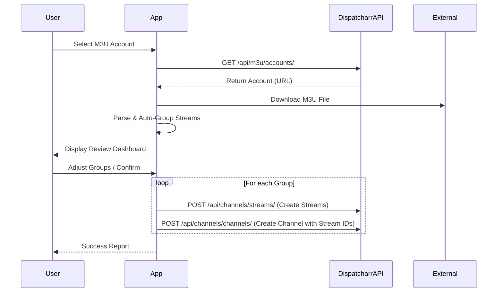

# Smart M3U Manager - Project Specification

## 1. Project Overview
A web-based intelligent management tool for Dispatcharr. The primary goal is to ingest raw M3U playlists and automatically consolidate duplicate streams (e.g., HD, FHD, Backup versions of "Channel X") into single, unified Channel entities within Dispatcharr, cleaning up the user's library.

## 2. Recommended Tech Stack
Given the requirement for ease of use into a rich web interface, we will use:

- **Framework**: **Next.js 14+ (App Router)**. This allows us to have a React frontend for the interactive UI and server-side API routes to handle heavy text processing (M3U parsing) without lagging the browser.
- **Language**: **TypeScript**. Essential for strongly typing the Dispatcharr API responses and our internal M3U structures.
- **Styling**: **Tailwind CSS**. For rapid, modern, "premium" styling.
- **UI Components**: **shadcn/ui** (based on Radix UI). Provides high-quality, accessible, and customizable components (Tables, Dialogs, Selects) that look professional out of the box.
- **State Management**: **Zustand** or React Context for managing the "Draft" channel list state before saving.

## 3. Core Features & Workflow

### Phase 1: Connection & Source Selection
- **API Connection**: Input Dispatcharr URL and Auth Token (if needed, though endpoints seen are mostly open/token-based).
- **M3U Browser**: List existing `M3UAccount`s from Dispatcharr (`/api/m3u/accounts/`).
- **Selection**: User selects one M3U Account to process.

### Phase 2: Analysis & Intelligence (The Brain)
- **Download & Parse**: The app downloads the raw M3U text from the selected account's URL.
- **Parsing**: detailed extraction of:
  - `tvg-id` (EPG ID)
  - `tvg-name`
  - `group-title`
  - Stream URL
  - Channel Name (clean/raw)
  - Logos
- **Grouping Engine**:
  - The system iterates through all parsed streams.
  - **Strategy A (Primary)**: Match by `tvg-id`. If multiple streams share `tvg-id="ES:Tele5"`, they are grouped.
  - **Strategy B (Secondary)**: Fuzzy name matching. If `tvg-id` is missing, compare names like "Tele 5 FHD" and "Tele 5 HD" -> Group as "Tele 5".
  - **Strategy C (Exact)**: Match by exact channel name.

### Phase 3: Review & Refine (The "Smart" UI)
- **Unified Grid View**: Show the proposed *Channels*, not streams.
  - Example Row: **"Telecinco"** | *3 Streams (FHD, HD, SD)* | *Group: General*
- **Expandable Details**: User can click a row to see the specific streams inside and uncheck/remove bad ones.
- **Manual Merge/Split**: Drag-and-drop or checkbox selection to manually merge disparate groups that the AI missed.

### Phase 4: Execution
- **Target Selection**: Choose a destination **Channel Group** in Dispatcharr (pick existing or create new).
- **Batch Creation**:
  1. Create `Channel` entity in Dispatcharr (`/api/channels/channels/`).
  2. Create `Stream` entities linked to that Channel (`/api/channels/streams/`).
  - *Note: Dispatcharr API structure implies Channel has `streams` array. We need to verify if we create Streams first and link them, or create Channel with stream links.*

## 4. detailed Data Flow



## 5. grouping Strategies Draft

1.  **Strict ID Match**:
    - Key: `tvg-id`
    - Action: All entries with identical non-empty `tvg-id` are merged.
2.  **Name Normalization Match**:
    - Key: Channel Name
    - Normalization: Remove tags like `[FHD]`, `(HD)`, `|ES|`, `50FPS`.
    - Action: If `normalize(A) == normalize(B)`, merge.

## 6. Implementation Questions to Resolve
- **API Capability**: Can we directly create a Channel with multiple streams in one POST, or do we need to create Streams individually first?
  - *Swagger check*: `/api/channels/channels/` POST takes `streams: integer[]`. So we must create Streams first, get their IDs, then create the Channel.
- **Duplicates**: How to handle re-runs? (If I run this tool twice, avoid creating duplicate channels?)
```
